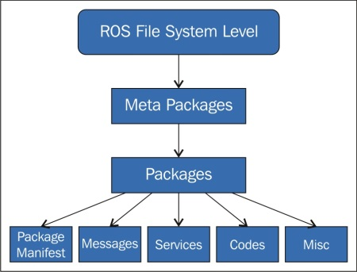

# Item: ROS Introduction 

#### References

1. **ROS:** http://wiki.ros.org/
2. **Willow Garage:** http://www.willowgarage.com/
3. **OSRF:** http://www.osrfoundation.org/
4. **ROS Concepts:** http://wiki.ros.org/ROS/Concepts
5. **ROS Tutorials:** http://wiki.ros.org/ROS/Tutorials
6. **ROS Available Packages:** http://www.ros.org/browse/list.php
7. **ROS Parameter Server:** http://wiki.ros.org/Parameter%20Server

## Introduction To ROS

Item <a href ="ros_install.md">Install ROS</a> goes over how to install ROS on your machine.
In this item we will go over some basic items refarding the Robot Operationg System. Concretely, we will
talk about

- What is ROS
- ROS functionality
- ROS filesystem
- ROs computation graph

Some of the things outlined in this item are also presented in the video below.

[](http://www.youtube.com/watch?v=0BxVPCInS3M "Programming for Robotics (ROS) Course 1")


### What Is ROS

Let's start by first trying to answer what is ROS. ROS stands for _Robot Operating System_. However, despite its name, it is not an actual OS. 
It is rather a middleware that stands between the actual OS and the programs that run on top of it. 
ROS is an open source software framework for programming robots. 
It provides a hardware abstraction layer in which developers can build robotic 
applications without worrying about the underlying hardware.

---

**Remark: Some History**

ROS, started in 2007 in Stanford University. Its original  name was Switchyard. 
Willow Garage then in 2008 undertook the development. 
In 2013 the Open Source Robotics Foundation was formed that actively maintains ROS since then.

You can get a list of robots that use ROS in the following link: https://robots.ros.org/

---


---

**Remark: ROS Distributions**

There are several ROS distributions available, see http://wiki.ros.org/Distributions. 
These are fully compatible with Ubuntu, and most of them are planned according to the respective Ubuntu versions. 

ROS is tuned of Ubuntu as the underlying OS. Othen than that you may find some support  forARM, Debian, 
Gentoo, Mac OS X, Arch Linux, Android, Windows, and Open Embedded.

---

The core of the framework is a message-passing middleware. In this framework processes can communicate and exchange data 
with each other even when running from different machines. 
We will say more about the communication in ROS in Item <a href="#">Communication In ROS</a>
 for the time let us note that ROS message passing can be synchronous or asynchronous.

Software in ROS is organized in packages. This approach offers  both good modularity and reusability. 
Using the ROS message-passing middleware and hardware abstraction layer, developers can create various robotic capabilities, 
such as mapping and navigation for mobile robots. 
It can be said that almost all capabilities in ROS are be robot unaware. Thus,  different types of robots can use it. 


ROS aspires to be a generic software stack for the development of robotic platforms. Given this, it offers some rich functionality:


- Sensors support http://wiki.ros.org/Sensors
- Interface to popular 3rd party libraries such as OpenCV, https://opencv.org/, and Point Cloud Library (PLC), http://pointclouds.org/.
- Language support for C++, Python and Lisp whilst there exist some experimental libraries for Java and Lua
- Simulator integration like Gazebo and V-REP
- Code testing using ```rostest```
- Scalability

### ROS Fundamentals

Now that we have seen briefly what ROS is all about and what it offers let's get into some terminology around ROS. In particular we want to address the following:

- Filesystem 
- Computation graph
- Community

Let's start with ROS filesystem.

#### Filesystem

The filesystem level concepts cover mainly  ROS resources that you encounter on disk. 
This level includes concepts that explain how ROS is internally formed and the folder structure. 
Similar to an OS, a ROS program is divided into folders. 
These folders have files that describe their functionalities. These are:

1. **Packages:** Packages are somehow the atomic level of ROS. A package has the minimum structure and content to create a program within ROS. Typically, it contains
the  nodes, see the **Computation Graph** section below,  and configuration files etc. See http://www.ros.org/browse/list.php for a list of already available packages.
2. **Package Manifests:** Manifests (```package.xml```) provide metadata about a package, including its name, version, description, license information, dependencies, and other meta information like exported packages. The package.xml package manifest is defined in <a href="http://www.ros.org/reps/rep-0127.html">REP-0127</a>. 
3. **Metapackages:** Metapackages are specialized Packages which only serve to represent a group of related other packages. 
Usually, metapackages are used as a backwards compatible place holder for converted rosbuild Stacks. 
4. **Repositories:** A collection of packages which share a common VCS system. Packages which share a VCS share the same version and can be released together using the catkin release automation tool . Often these repositories will map to converted rosbuild Stacks. Repositories can also contain only one package. 
5. **Message (msg) types:** Message descriptions, stored in ```my_package/msg/MyMessageType.msg```, define the data structures for messages sent in ROS. 
6. **Service (srv) types:** Service descriptions, stored in ```my_package/srv/MyServiceType.srv```, define the request and response data structures for services in ROS. 


The following figure shows schematically the file system in ROS:




*Fig: ROS file system.*

#### Computation Graph 

The functionality relate to a robotic platform is implemented on a node. A node is an actual OS process. Nodes may be running on different machines and in this case we have a distributed system. ROS nodes are arranged into a graph called the Computation Graph. This computation graph is the peer-to-peer network of the ROS process. 
Furthermore, the following concepts are also related to the computation graph:
  
- Nodes
- Master node
- Topics
- Messages
- Parameter server
- Services
- Bags 

All these entities provide data to the compuation graph in various ways. Let's get into more details. 

- **Nodes:** A ROS node is essentially a single-purpose executable program. Typically, a ROS node does something for example process data, command hardware, execute algorithms. 
Nodes are organized into packages in order to enhance modularity. 
Often  they are often written in C++ or Python. Usually, a system will have many nodes to control different functions. 
Nodes are written using a ROS library such as  ```roscpp``` or ```rospy```. Finally, here some very useful commands related to nodes:

- **```rosnode list```:** This command prints a list of all running nodes
- **```rqr_graph```:** Privides a visual representation of the ROS node graph
- **```rosnode info <node_name>```:** Node specific information on the terminal

- **The master node:** Recall that a ROS application is a collection of ROS nodes that communicate with each other. 
The master node is a special ROS node that is required in order to execute a ROS application. 
This node provides the registration of names and the lookup service to the rest of the nodes in the team. 
Furthermore, it also sets up connections between the nodes.  It should be emphasized that we cannot start executing our ROS software without having started the master node. 
This can be done issuing ```roscore```.

---

**Remark: ```roscore```**

```roscore``` is a service that provides connectivity information to the participating nodes so that the latter can transmit messages to one another. 
Every node should connect to ```roscore``` at startup in order to register details of the message streams it publishes and the streams to which it wishes to subscribe.
When a new node appears, ```roscore``` provides it with the information that it needs in order to form a direct peer-to-peer connection 
with other nodes publishing and subscribing to the same message topics. 

Every ROS system needs a running ```roscore``` since without it, nodes cannot find other nodes.
Thus, ```roscore``` is the master node that manages the communication between nodes. 
A key aspect of ROS is that the messages between nodes are transmitted peer-to-peer. 
The ```roscore``` is only used by nodes to know where to find their peers.

When a ROS node starts up, it expects its process to have an environment variable
named ```ROS_MASTER_URI``` . This variable is expected to contain a string of the form ```http://hostname:11311/```  , 
which in this case would imply that there is a running instance of ```roscore``` accessible on port ```11311``` 
somewhere on a host called ```hostname``` that can be accessed over the network.


Having known the location of ```roscore``` on the network, nodes can register themselves
at startup with ```roscore``` and then query ```roscore``` to find other nodes and data streams
by name. Each ROS node tells ```roscore``` which messages it provides and which it
would like to subscribe to. ```roscore``` then provides the addresses of the relevant message producers and consumers.

---


- **Topics:** Transport information between nodes, in the form of messages. Each message must have a name to be routed by the ROS network. 
When a node is sending data, we say that the node is **publishing to a topic**. 
Nodes can receive topics from other nodes simply by **subscribing to the topic**. 
A node can subscribe to a topic, and it is not necessary that the node that is publishing this topic should exist. 
This permits us to decouple the production from the consumption. Finally, in order  to avoid problems and confusion between topics with the same name, the name of the topic shouild be unique.

ROS topics are identified by a name and a type. Some useful commands related to topics are

- **```rostopic list```:** List all topics that are being exchanged between nodes
- **```rostopic info <topic_name> ```:** Prints specific information for the named topic
- **```rostopic echo <topic_name>```:** Prints topic contents on the terminal

---
**Remark**

Any number of nodes can publish to a single topic as long as the message has the right type.

---


- **Messages:**  A ROS message is a data structure that defines the type of a topic. A message is simply a data structure, comprising typed fields. 
Standard primitive types (integer, floating point, boolean, etc.) are supported, as are arrays of primitive types. 
Messages can include arbitrarily nested structures and arrays (much like C structs). Below are two examples of ROS messages:


```
Point.msg
----------

float64 x
float64 y
float64 z
```

```
image.msg
----------
std_msgs/Header header
    uint32 seq
    time stamp
    string frame_id
uint32 height
uint32 width
```


---

---

**Remark:** 
Messages are defined in ```*.msg``` files. 

---

- **Parameter Server:** ```roscore``` also provides a parameter server, see http://wiki.ros.org/Parameter%20Server,  which is used extensively by ROS nodes for configuration. The parameter server gives us the possibility to have a key-value central storage location. Hence, the parameter server allows nodes to store and retrieve arbitrary data structures, such as descriptions of robots, parameters for algorithms, and so on at run time. As with everything in ROS, there is a simple command-line tool to interact with the parameter server: ```rosparam```. Therefore, with the parameter server, it is possible to configure nodes while it's running or to change the working of the nodes.


- **Bags:** Bags are a format to save and play back the ROS message data. Bags are an important mechanism to store data, such as sensor data, that can be difficult to collect but is necessary to develop and test algorithms. You will use bags a lot while working with complex robots.


- **Services:** We will discuss more the concept of services in <a href="#">ROS Services</a>. At the time being, it suffices to know that services are used for request-reply interactions, which are often required in a distributed system. They are defined by a pair of message structures: one for the request and one for the reply. A providing node offers a service under a name and a client uses the service by sending the request message and awaiting the reply. ROS client libraries generally present this interaction to the programmer as if it were a remote procedure call.

---

**Remark: Compuatation Graph Visuzlization**

We can use the ```rqt_graph``` tool to visualize computation graph.

---
