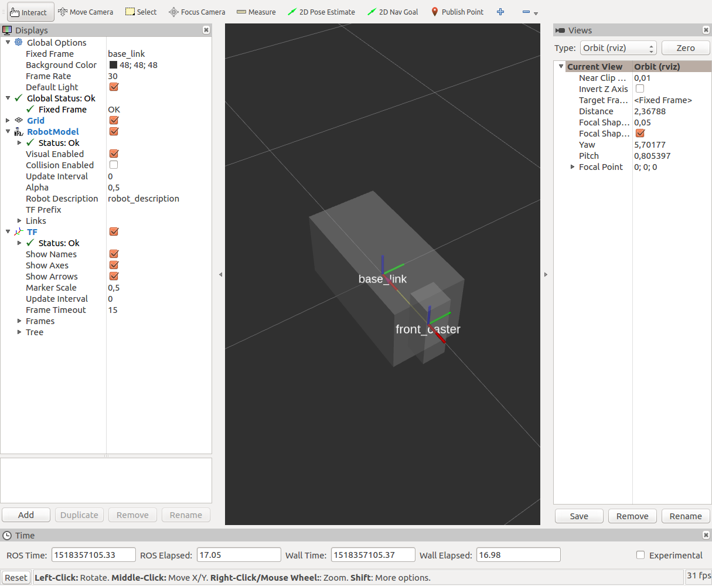

# Item: ROS URDF

#### References

1. **ROS URDF:** http://wiki.ros.org/urdf
2. **ROS XARCO:**  http://wiki.ros.org/xacro
3. **Building a Visual Robot Model with URDF from Scratch:** http://wiki.ros.org/urdf/Tutorials/Building%20a%20Visual%20Robot%20Model%20with%20URDF%20from%20Scratch
4. **Building a Movable Robot Model with URDF:** http://wiki.ros.org/urdf/Tutorials/Building%20a%20Movable%20Robot%20Model%20with%20URDF

ROS URDF is discussed in the following  videos

[](https://www.youtube.com/watch?v=_GgHFuib_LU "Programming for Robotics (ROS) Course 3")
[](https://www.youtube.com/watch?v=UUwHK5ONTAQ "[ROS Tutorial] Robot Creation with URDF ROS. Create URDF files by creating 3 robots.")


## ROS URDF

Modelling the robot environment is an essential part of creating a successful ROS application. 
Using the Unified Robot Description Format (URDF) you can create a model of the robot and the environment that the robot operates.

URDF technically is a domain specific modeling language (DSML) based on the XML format. 
It is used  for representing a robot model in terms of:

- Kinematics 
- Dynamics 
- Visual representation
- Collision model

In this item we will focus on the basics of URDF. Furthermore, links and joints, joint types and standardization will be explained.

URDF files mostly contain the following elements: ```<link>``` and ```<joint>``` which correspond to the links and joints of a robot.  
```<link>```s determine the robot structur whilst ```<joint>```s determine connection and motion constraints. 
So a robot as far as URDF is concerned is a set of links connected via joints in a certain order. 
If this order changes then the motions that a robot can attain change also.

---
**REMARK** 

The robot description (URDF) is stored on the parameter server, typically, under ```/robot description```. We can visualize the robot model in ```rviz``` with the ```RobotModel``` plugin.

---

---
**REMARK**

URDF files can become quite verbose and hence hinder maintainance. XARCO is a ROS tool that helps us generate URDF files.

---


Let's see a small example, to start understanding how a URDF file looks like.

### Example 1


The code snippet below shows a tiny but valid URDF file. It models a robot named ```tiny_robot``` that has one link called ```link_1```:

```
<robot name="tiny_robot">
   <link name="link_1"  />
</robot>
```
A link is a rigid body, such as a chassis or a wheel. On the other hand, a joint connects two links, defining how they can move with respect to each other. 
Let's now add a second link and a joint as shown in the code snippet below:

```
<robot name="tiny_robot">
   <link name="link_1"  />
   <link name="link_2"  />
   <join name="join_1" type="..">
      <parent link="link_1"  />
      <child link="link_2"  />
   </joint>
</robot>
```

This represents the following structure shown below.


*Fig: tiny_robot joints and links.*

Notice that above the link type is actually not specified. URDF supports the following types of joints:

- Fixed joints
- Revolute joints: 1D rotation of the child link with respect to the parent
- Continuous joints: unlimited revolute
- Prismatic joints: 1D translation of the child with respect to the parent link
- Planar joints: 2D translation
- Floating joints: allow motion and rotation without any limits in any direction (6D)


---
**REMARK**

When comes to modeling, sooner or later the issue of the coordinate system used comes into play. 
By convention, ROS uses a right-hand coordinate system: so positive $X$ points forward, positive $Y$ points left and thus positive $Z$ points upward.

---


---
**REMARK: SI Units**

Just as the issue of coordinate system is important when modeling robots, the units used are also significant. 
By convention ROS uses SI units. 

---

### Example 2

Let's now see a slightly more complicated example. The modeled robot will have the following features

- One chassis
- Two rear wheels, attached to the chassis
- One front caster, attached to the chassis
- One front wheel, attached to the front caster


---
**REMARK**

URDF is only capable of representing robots whose kinematics can be described by a tree; 
looping structures are not allowed (fortunately, with the exception of a certain class of manufacturing robots, looping structures are fairly uncommon in robotics).

---

The code snippet belows is the URDF description for our robot.

```
<?xml version="1.0"?>
<robot name="Odisseas">
	<link name="base_link">
		<visual>
			<geometry>
				<box size="0.6 0.3 0.3"/>
			</geometry>
			<material name="silver">
				<color rgba="0.75 0.75 0.75 1"/>
			</material>
		</visual>
	</link>
</robot>
```

This short model declares one link, called ```base_link``` 
(this name is more common than chassis in ROS systems), which is visually represented by a box (a rectangular solid) that measures ```0.6 m x 0.3 m x 0.3 m```. 

---
**REMARK** 

As with all URDF links, by default, the origin of this box is its center.

---


We give the box a color that we call ```silver``` defined in the
commonly used RGBA space, which combines levels of red, green, and blue to form a color 
(the A is for alpha, which represents transparency, where 0 is transparent and 1 is opaque). To see what this model looks like, save that code to a file called odisseas.urdf, and use: 


```
roslauch urdf_tutorial/display.launch model:=odisseas.urdf
```


You should see ```rviz``` pop up, showing you a single oblong silver box, similar to the following image


*Fig: tiny_robot joints and links.*


Next let’s add the front caster. We can represent it as another oblong box, oriented vertically and attached to the front of the chassis, as shown in the figure below




*Fig: The  rviz visualizer with Odisseas.*


```
<link name="front_caster">
		<visual>
			<geometry>
				<box size="0.1 0.1 0.3"/>
			</geometry>
			<material name="silver"/>
		</visual>
	</link>
	<joint name="front_caster_joint" type="continuous">
		<axis xyz="0 0 1"/>
		<parent link="base_link"/>
		<child link="front_caster"/>
		<origin rpy="0 0 0" xyz="0.3 0 0"/>
	</joint>
```

The caster looks like it’s in the right place, but how can we check whether the joint is
working correctly? Fortunately, the URDF display tool can help. Launch it again, this
time with the extra argument ```gui:=True```: 


```
roslauch urdf_tutorial/display.launch model:=odisseas.urdf gui:=True
```


Now, in addition to ```rviz``` , you’ll get a small control GUI called the ```joint_state_publisher```. The ```joint_state_publisher``` can be used to control our newly defined joint. Slide it
back and forth, and in ```rviz``` you should see the front caster rotate back and forth with respect to the chassis. As you can already, the URDF display tool, along with the control GUI, provides an invaluable way of checking, debugging, and fixing a URDF model.

Let's add the wheels of the robot now.


```
<link name="front_wheel">
		<visual>
			<geometry>
				<cylinder length="0.05" radius="0.035"/>
			</geometry>
			<material name="black"/>
		</visual>
	</link>
	<joint name="front_wheel_joint" type="continuous">
		<axis xyz="0 0 1"/>
		<parent link="front_caster"/>
		<child link="front_wheel"/>
		<origin rpy="-1.5708 0 0" xyz="0.05 0 -.15"/>
	</joint>
	
	<link name="right_wheel">
		<visual>
			<geometry>
				<cylinder length="0.05" radius="0.035"/>
			</geometry>
			<material name="black">
				<color rgba="0 0 0 1"/>
			</material>
		</visual>
	</link>
	<joint name="right_wheel_joint" type="continuous">
		<axis xyz="0 0 1"/>
		<parent link="base_link"/>
		<child link="right_wheel"/>
		<origin rpy="-1.5708 0 0" xyz="-0.2825 -0.125 -.15"/>
	</joint>
	
	<link name="left_wheel">
		<visual>
			<geometry>
				<cylinder length="0.05" radius="0.035"/>
			</geometry>
			<material name="black"/>
		</visual>
	</link>
	<joint name="left_wheel_joint" type="continuous">
		<axis xyz="0 0 1"/>
		<parent link="base_link"/>
		<child link="left_wheel"/>
		<origin rpy="-1.5708 0 0" xyz="-0.2825 0.125 -.15"/>
	</joint>
```

This URDF snippet declares a new link for the wheel itself, represented as a cylinder,
and a new continuous joint to connect the wheel to the caster. Note that the origin of the joint is offset in $y$ and $z$ to move it to the front bottom of the caster, and also rotated about $x$ to put the round part of the wheel on the ground. Run the display tool again to check the result. Now you’ll have two sliders in the ```joint_state_publisher```
GUI, one for the caster joint and one for the front wheel joint. Try them both to check the rotation axes and directions.

Eventually our model will look like the image below


*Fig: The ```rviz``` visualizer with Odisseas final version..*
